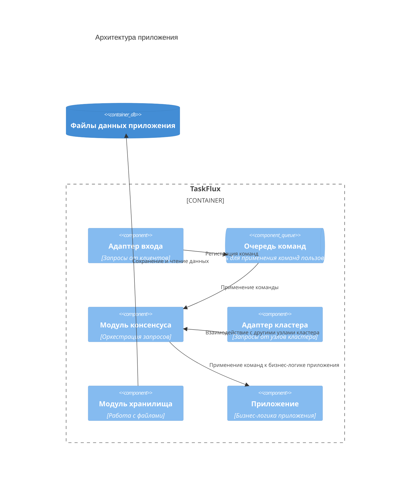

На этой странице дан краткий обзор архитектуры системы.

# Общая архитектура

Приложение состоит из нескольких компонент:

- Модуль консенсуса
- Компонент приложения
- Модуль кластера
- Модули входа (запросов клиентов)
- Модуль хранилища

На диаграмме ниже представлена высокоуровневая архитектура приложения.

# Модуль консенсуса

Этот компонент используется для оркестрации и управление поведением приложения в соответствии с алгоритмом консенсуса Raft.

Его обязанности:
- Участие в выборах кластера
- Поддержание согласованности кластера
- Обработка запросов пользователя

Узел в кластере может иметь одну из ролей:
- Лидер
- Кандидат
- Последователь

Роли и их обязанности равны тем, что указаны в алгоритме консенсуса Raft. 
В данной версии, их ответственность не изменена относительно изначального [документа](https://raft.github.io/raft.pdf).

Детали реализации:
- Для реализации ролей используется паттерн Состояние: каждая роль представлена отдельным классом:
  - Лидер: [LeaderState](../../src/Consensus/TaskFlux.Consensus/State/LeaderState/LeaderState.cs)
  - Кандидат: [CandidateState](../../src/Consensus/TaskFlux.Consensus/State/CandidateState/CandidateState.cs)
  - Последователь: [FollowerState](../../src/Consensus/TaskFlux.Consensus/State/FollowerState.cs)
- Фоновые задачи выполняются в отдельных потоках.
  Каждая задача реализует специальный интерфейс задачи, например, задача сбора кворума ([PeerElectorBackgroundJob](../../src/Consensus/TaskFlux.Consensus/State/CandidateState/PeerElectorBackgroundJob.cs)).
  На каждый узел кластера (кроме себя) заводится фоновый поток, который последовательно выполняет поступающие задачи.
  Реализация этой очереди задач - [ThreadPerWorkerBackgroundJobQueue](../../src/TaskFlux.Application/ThreadPerWorkerBackgroundJobQueue.cs).
- Таймеры реализуются с помощью таймеров платформы .NET (`System.Threading.Timers.Timer`).
  Реализация таймера - [ThreadingTimer](../../src/Consensus/TaskFlux.Consensus/Timers/ThreadingTimer.cs).
  Представленная реализация - базовая, так как таймеров есть 2 вида: с постоянным интервалом ожидания ([ConstantThreadingTimer](../../src/Consensus/TaskFlux.Consensus/Timers/ConstantThreadingTimer.cs), для Heartbeat) и случайным ([RandomizedThreadingTimer](../../src/Consensus/TaskFlux.Consensus/Timers/RandomizedThreadingTimer.cs), для таймаутов ожидания ролей)
- Состояние приложения восстанавливается каждый раз, когда узел становится лидером. 
  То есть в остальных состояниях в памяти не содержится данных приложения. 

# Компонент приложения

Этот компонент содержит основную логику приложения.

Сама бизнес-логика располагается в 2 проектах:

- [`TaskFlux.Core`](../../src/TaskFlux.Core/) - логика и использование
- [`TaskFlux.PriorityQueue`](../../src/TaskFlux.PriorityQueue/) - реализация приоритетных очередей
- [`TaskFlux.Models`](../../src/TaskFlux.Models/) - общие модели (классы)

> Проект `TaskFlux.Models` выделен, по-большей части, для корректного управления зависимостями:
> некоторые проекты используют модели, но знание о другой логике им не нужна.
> Пример, сериализация

Доступ к приложению осуществляется через модуль консенсуса.
Это необходимо для проверок на то, что узел является лидером - только в этой роли узел может обрабатывать запросы клиентов.

> Замечание: ReadOnly запросы обрабатываются также только Лидером - Последователь и Кандидат не могут.

Обработка запросов реализована следующим образом:

- Все приходящие запросы попадают в очередь команд - [`IRequestAcceptor`](../../src/TaskFlux.Application/IRequestAcceptor.cs)
- Каждая команда представляется базовым классом [`Command`](../../src/TaskFlux.Core/Commands/Command.cs)
- Каждый запрос клиента может быть выполнен как единственной, так и несколькими командами:
  - Для получения размера очереди - 1 команда [`CountCommand`](../../src/TaskFlux.Core/Commands/Count/CountCommand.cs)
  - Для чтения записи из очереди, с учетом подтверждений, - 2 команды [`ImmediateDequeueCommand`](../../src/TaskFlux.Core/Commands/Dequeue/ImmediateDequeueCommand.cs), [`AwaitableDequeueCommand`](../../src/TaskFlux.Core/Commands/Dequeue/AwaitableDequeueCommand.cs)
- При выполнении команды она возвращает результат работы - [`Response`](../../src/TaskFlux.Core/Commands/Response.cs)
- Каждая команда может вернуть не только соответствующий только ей ответ, но и общий:
  - Для ответа на `CountCommand` - конкретный [`CountResponse`](../../src/TaskFlux.Core/Commands/Count/CountResponse.cs)
  - Ошибка при выполнении может случиться (почти) у каждой команды - [`ErrorResponse`](../../src/TaskFlux.Core/Commands/Error/ErrorResponse.cs)

Для разграничения команд и ответов используется 2 механизма:

- Паттерн посетитель
- Теги

Все команды и их возможные ответы расположены в [`TaskFlux.Core/Commands`](../../src/TaskFlux.Core/Commands/).

# Модуль кластера

Этот компонент отвечает за принятие и обработку запросов от других узлов кластера.

Данная функциональность реализована в 2 компонентах:

- Принятие подключений - [`NodeConnectionManager`](../../src/TaskFlux.Application/Cluster/NodeConnectionManager.cs)
- Обработка узла - [`NodeConnectionProcessor`](../../src/TaskFlux.Application/Cluster/NodeConnectionProcessor.cs)

Оба компонента запускаются в отдельных потоках - пул потоков не используется, так как возможно голодание пула потоков, что может привести к неопределенному поведению/уменьшению производительности/ошибкам в работе и другим неблагоприятным последствиям.

> Единственное место где используется пул потоков - изначальное принятие подключение и авторизация.

В отличие от запросов клиентов, очереди обработки запросов узлов нет - каждый принятый запрос направляется модулю консенсуса сразу, без использования очереди.
Многие операции потоко-безопасные:
- Работа с диском происходит под блокировкой
- Обновление состояния с использованием CAS

Других модифицирующих операций нет.

# Модуль входа (запросов клиентов)

Адаптер (транспорт)- это способ, с помощью которого взаимодействует клиент с приложением. Оба термина используются взаимозаменяемо, особой разницы (пока) нет.

Для обработки запросов клиентов построена обобщенная инфраструктура, которая не привязана к конкретному типу протокола взаимодействия:

- Каждая операция представляется классом `Command`, а ответы - `Response`
- Для применения этих команд и получения ответов используется очередь команд - `IRequestAcceptor`
- Для обработки сложных команд используется функциональность исполнителей. Например, для обработки операции чтения с учетом подтверждений - [`DequeueExecutor`](../../src/TaskFlux.Application/Executor/DequeueExecutor.cs)

Таким образом, главная задача адаптера входа - сериализация и десериализация протоколоо-специфичных сообщений клиента.

Все проекты адаптеров располагаются в директории `TaskFlux.Transport`.
На данный момент, имеется 3 адаптера входа:
- HTTP - [`TaskFlux.Transport.Http`](../../src/TaskFlux.Transport/TaskFlux.Transport.Http/)
- TCP - [`TaskFlux.Transport.Tcp`](../../src/TaskFlux.Transport/TaskFlux.Transport.Tcp/)
- gRPC - [`TaskFlux.Transport.Grpc`](../../src/TaskFlux.Transport/TaskFlux.Transport.Grpc/)

Так как логика обработки запросов не привязана к конкретному транспорту, то каждый может иметь свои особенности или функциональность. 

## HTTP

Принимает команды по HTTP.
Реализуется с помощью ASP.NET Core MVC.
Для каждой команды имеется отдельный эндпоинт.

Этот эндпоинт не поддерживает подтверждения, поэтому:
- В `DequeueCommand` имеется флаг `Persistent` - необходимо сразу сохранить операцию в лог без подтверждений
- Ожидающие команды не работают

## Tcp

Принимает команды по собственному клиент-сервеному протолу.

Для удобства имеется клиент-серверная библиотека - [`TaskFlux.Transport.Tcp.Client`](../../src/TaskFlux.Transport/TaskFlux.Transport.Tcp.Client/).
На данный момент, из коробки только эта библиотека поддерживает переподключение к лидеру кластера в случае недоступности. 
Для других транспортов, клиент должен сам реализовывать механизм переподключений.

## gRPC

Команды отправляются с помощью gRPC.
В файле [`taskflux.proto`](../../src/TaskFlux.Transport/TaskFlux.Transport.Grpc/Proto/taskflux.proto) определен proto файл для генерации кода клиента.
Благодаря этому, клиент на любом ЯП может взаимодействовать с приложением.

Замечание по реализации: для механизма подтверждений используется механизм двунаправленного общения (stream).
И каждый запрос/ответ может содержать в себе либо запрос, либо подтверждение.
Реализуется это с помощью `oneof` - перечисления. 
Следить за тем, какое сообщение отправляется должен клиент - если получено неожиданное сообщение, то операция завершается.

# Модуль хранилища

Этот модуль отвечает за хранение данных приложения на диске в файлах.

На диске хранятся данные:

- Узла кластера - для корректной работы в кластере
- Пользовательские - сами данные очередей, бизнес-логика

Больше о том, какие данные хранятся и в каких файлах на странице [Хранилище](../persistence.md).

Всего есть 3 файла:
- WAL
- Снапшот
- Метаданные

Хранилище представляется интерфейсом [`IPersistence`](../../src/Consensus/TaskFlux.Consensus/IPersistence.cs).
Реализация в проекте [`TaskFlux.Persistence`](../../src/TaskFlux.Persistence) в классе [`FileSystemPersistenceFacade`](../../src/TaskFlux.Persistence/FileSystemStreamExtensions.cs)

Для тестируемости, в проекте используется виртуализация файловой системы.
Это реализовано с помощью библиотеки `System.IO.Abstractions`.

Каждый файл представляется отдельным классом, который реализует необходимые методы для работы.
Как понятно из названия `FileSystemPersistenceFacade` - это фасад для оркестрации работы с этими отдельными файлами.

## WAL

Это журнал предзаписи. 
В него записываются команды прежде чем быть примененными. 
В реализации используется сегментированный лог, поэтому представление в коде следующее:
- `FileLog` - представление WAL
- `LogSegment` - отдельный сегмент лога

Они разделяют между собой логику работы:
- `FileLog` - фасад для работы с множеством сегментов: выбор необходимого сегмента, создание новых или открытие старых сегментов, оркестрация чтения или записи из множества сегментов
- `LogSegment` - вся логика относящаяся к операциям над одним сегментом: непосредственная запись или чтение, открытие или закрытие, инициализация.

Для отказоустойчивости используются следующие механизмы:
- Инициализация нового сегмента происходит с помощью `Atomic Create via Replace` паттерна - сначала создается временный файл сегмента, а когда заголовок успешно иницилазирован, то файл переименовывается (`Rename()`)
- После записи всех данных, вызывается `Stream.Flush(true)` - это необходимо для того, чтобы убедиться что все данные точно попали на диск
- Для записанных данных подсчитывается чек-сумма и при очередном чтении чек-сумма снова рассчитывается и сверяется с прочитанной (алгоритм чек-суммы CRC32)

## Снапшот

Снашпот хранит слепок состояния приложения.
Представляется классом [`SnapshotFile`](../../src/TaskFlux.Persistence/Snapshot/SnapshotFile.cs).

Для создания снапшота используется паттерн `Atomic Create via Replace` (что и для сегмента лога).
Но так как создание снапшота может быть инициировано в различных местах (отправка `InstallSnapshotRequest`, либо самим приложением (при превышении размера лога)), то логика его создания вынесена в отдельное место.

[`ISnapshotFileWriter](../../src/Consensus/TaskFlux.Consensus/ISnapshotFileWriter.cs) - интерфейс для создания новых снапшотов. 
Он позволяет создать новый снапшот записывая его кусками (чанками). 
Это полезно только для установки снапшота от лидера (сетевые запросы).

## Метаданные

В этом файле содержатся данные для работы приложения в кластере:
- Терм
- Отданный голос в этом терме

Реализуется в классе [`MetadataFile`](../../src/TaskFlux.Persistence/Metadata/MetadataFile.cs)

Этот файл занимает достаточно малое количество места (не больше 100 байт на данный момент).
Мы предполагаем, что запись данных размером сектор - атомарна, поэтому для большей производительности здесь не используются паттерны отказоустойчивой записи, например WAL или `Atomic Update via Rename`.
