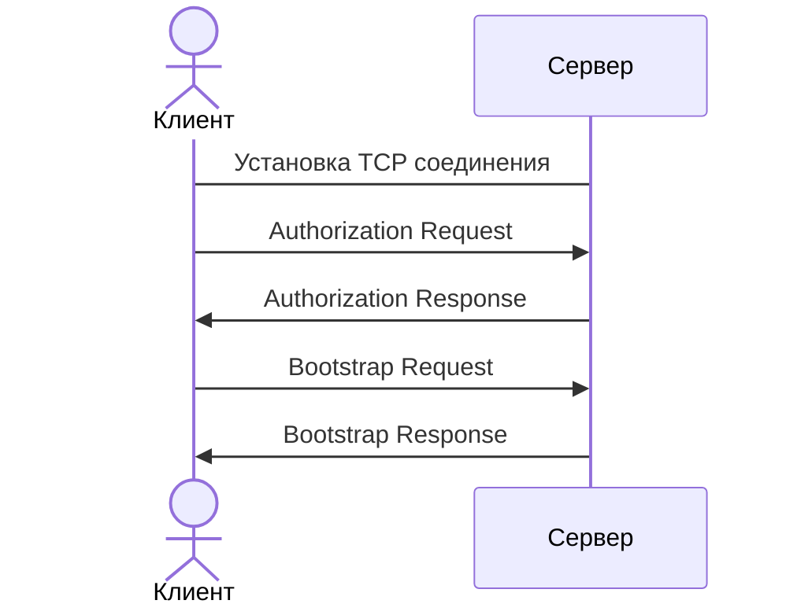
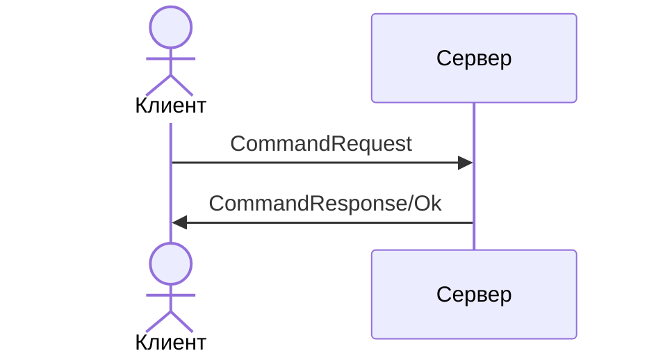
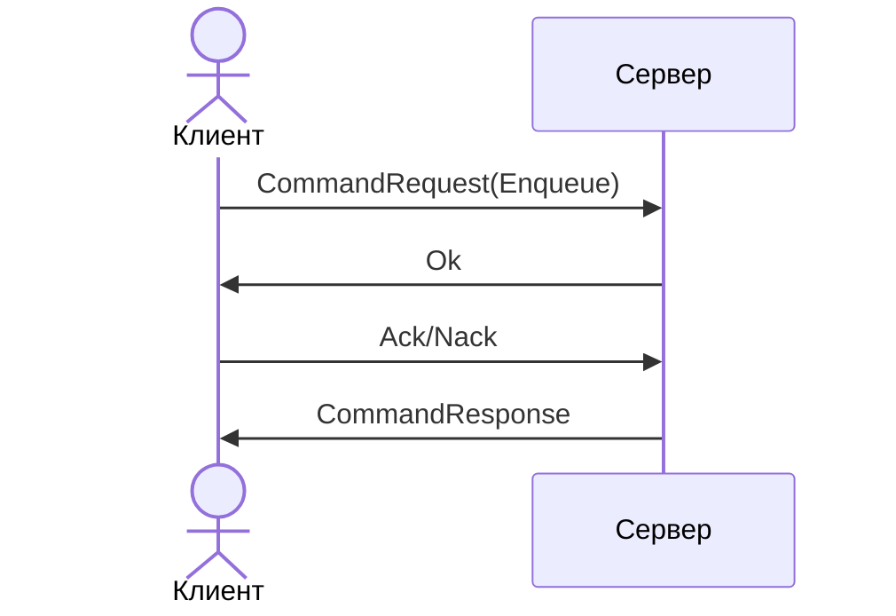
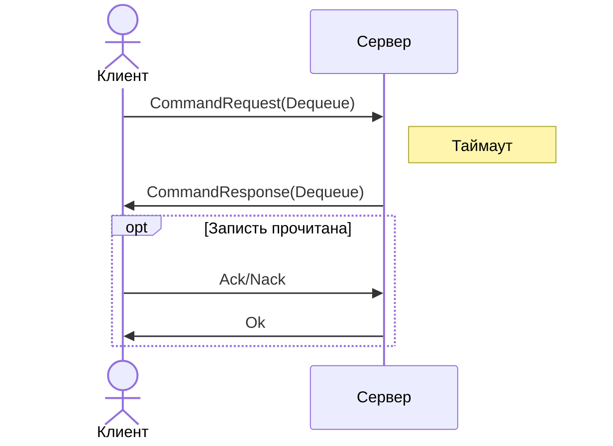

# Клиент серверный протокол

Для взаимодействия между клиентом и сервером используется клиент-серверный протокол, основанный на TCP.
Используемые базовые структуры данных описаны в секции [сетевого протокола](network-protocol.md#структуры-данных).

# Кейсы работы

В этой секции указаны основные случаи при работе с приложением: как установить соединение, выполнить команды и другие.

## Установление соединения

Подключение между клиентом и сервером инициирует клиент.

Алгоритм установления соединения:

1. Клиент устанавливает подключение с сервером (сокет)
2. Клиент отправляет [Authorization Request](#authorization-request) пакет, в котором указывает способ аутентификации и
   необходимые для этого данные.
3. Сервер авторизует клиента и отправляет [Authorization Response](#authorization-response) пакет клиенту
4. Иначе, если авторизация неуспешна:
   1. В ответном пакете указывается сообщение об ошибке
   2. Сервер закрывает соединение
   3. Конец
5. Клиент отправляет [Bootstrap Request](#bootstrap-request) пакет, в котором указывает версию приложения, с которой
   собирается работать
6. Сервер проверяет совместимость указанной версии со своей и отправляет [Bootstrap Response](#bootstrap-response) пакет
7. Если версии не совместимы:
   1. В ответном пакете указывается сообщение об ошибке
   2. Сервер закрывает соединение
   3. Конец
8. Сервер начинает обработку запросов пользователя

> На данный момент, аутентификация не поддерживается. В пакетах Authorization* указывается пустой тип аутентификации.

## Выполнение команд

Каждая команда бизнес-логики отправляется в отдельном пакете - [CommandRequest](#command-request).
При успешном выполнении команды, сервер отправляет [Command Response](#command-response), в котором содержится
результат.
Если в процессе выполнения возникли ошибки (не бизнес-логики), то возвращается [Error Response](#error-response) пакет и
соединение закрывается.

Каждая команда может быть 2 типов: требует подтверждения и немедленная.
Для немедленных команд поток выполнения одинаков.
Для требующих подтверждения собственные.

### Немедленная

Этот тип команд выполняется сразу, как только принимается сервером.
Для нее не нужно подтверждения.

Алгоритм:

1. Клиент отправляет [Command Request](#command-request) пакет с нужной командой
2. Сервер принимает команду и выполняет ее
3. Сервер отправляет клиенту:
   - Либо [Command Response](#command-response) клиенту с данными результатов работы
   - Либо [Ok](#ok) сигнализирующий об успешном выполнении команды

> Что должна возвращать команда после успешного выполнения (CommandResponse/Ok) прописано для каждой отдельно.

### Вставка

Это команда для вставки новой записи в очередь.

После того как клиент отправил [Command Request](#command-request) с командой [Enqueue](./commands.md#enqueue) (и сервер
его принял),
он должен дополнительно отправить [Acknowledge](#acknowledge) пакет и только после этого запись будет добавлена.

Алгоритм:

1. Клиент отправляет [Command Request](#command-request) с командой [Enqueue](./commands.md#enqueue)
2. Сервер принимает запрос
3. Сервер отправляет [Ok](#ok) пакет
4. Если клиент отправляет [Acknowledge](#acknowledge):
   1. Сервер выполняет запись в очередь
   2. Сервер отправляет [Command Response](#command-response) пакет с результатом выполнения команды
5. Иначе, если клиент отправляет [Negative Acknowledge](#negative-acknowledge-nack)
   1. Сервер отправляет [Ok](#ok) пакет
> Замечание: пока нет дополнительных проверок на то, можно ли выполнить запрос или нет.
> Например, проверить, что такая очередь существует.
> Может в будущем добавится, но семантика сейчас такая, что выполнение просто откладывается до получения нужного пакета.

### Чтение

Это команда для чтения записей из очереди.
На данный момент чтение происходит по 1 записи за раз, т.е. нельзя сразу прочитать пачкой и последовательно их
подтверждать.

Если клиент хочет прочитать запись из какой-либо очереди, то он отправляет [Command Request](#command-request)
с [Dequeue](./commands.md#dequeue) командой.
В этой команде можно указать таймаут чтения:

- `0` - выключить ожидание и получить ответ сразу
- другие значения - брокер будет ожидать указанное число мс прежде чем вернуть ответ.

> Если по истечению таймаута, новых записей не было, то сервер вернет Dequeue Response с пустым ответом и дальнейшая
> работа прекращается.

Когда из очереди была прочитана запись, то сервер отправляет [Command Response](#command-response) с прочитанной
записью.
По окончании обработки прочитанной записи, клиент отправляет [Acknowledge](#acknowledge) пакет на сервер и сервер
коммитит выполнение команды (запись в логе об удалении).
В конце, сервер отправляет [Ok](#ok) пакет клиенту.

Алгоритм:

1. Клиент отправляет [Command Request](#command-request) с [Dequeue](./commands.md#dequeue) командой
2. Если в очереди не было записей и был указан таймаут:
   1. Сервер ждет новых записей указанное время
3. Сервер отправляет [Command Response](#command-response) клиенту с прочитанной записью
   1. Если записей прочитано не было, то возвращается пустой ответ (пустая запись)
   2. Алгоритм заканчивается
4. Если клиент отправляет [Acknowledge](#acknowledge) серверу:
   1. Сервер коммитит выполнение команды (сохраняет команду в логе)
5. Иначе, если [Negative Acknowledge](#negative-acknowledge-nack):
   1. Сервер прекращает обработку этой команды
6. Сервер отправляет [Ok](#ok) пакет клиенту

> Замечание: если в очереди не было записей, то ничего подтверждать ничего не нужно, т.к. удаления не произошло

# Пакеты

В этой секции описаны пакеты, которые используются для обмена между клиентом и сервером.

## Command Request

Пакет, передающий основной запрос к узлу.
Тело представляет собой сериализованные данные команды.
После маркера идет 4 байтное целое число, определяющее длину тела.

Формат пакета:

| Маркер    | Данные |
|-----------|--------|
| Byte('C') | ...    |

В поле `Данные` содержится сериализованная команда.
Команды запроса представлены в [отдельной документации](commands.md#запросы).

## Command Response

Пакет, передающий ответ на запрос операции.
После маркера указывается 4 байтная длина тела запроса.
Содержимое тела зависит от переданного прежде **Data Request**

Формат пакета:

| Marker    | Payload |
|-----------|---------|
| Byte('c') | ...     |

Возможные ответы представлены в [документации команд](commands.md#ответы)

## Acknowledge

Пакет, посылаемый клиентом, когда необходимо зафиксировать результат выполнения команды.
Состоит из единственного байта-маркера.

Формат пакета:

| Маркер    |
|-----------|
| Byte('Q') |

## Negative Acknowledge (Nack)

Пакет, посылаемый клиентом, когда необходимо отменить выполнение команды.
Состоит из единственного байта-маркера.

Формат пакета:

| Маркер    |
|-----------|
| Byte('N') |

## Ok

Пакет, сигнализирующий о принятом запросе.
В основном используется как промежуточное звено в процессе обработки запросов (сигнал о принятом пакете).

| Маркер    |
|-----------|
| Byte('k') |

## Error Response

Пакет посылаемый клиенту сервером, если возникла ошибка при выполнении.

В поле `Код ошибки` содержится число описывающее какая ошибка произошла.
Если необходимо, то дополнительное описание ошибки представлено в поле `Детали`.

Формат:

| Marker    | Код ошибки | Детали | 
|-----------|------------|--------|
| Byte('e') | Int32      | String |

## Not Leader

Пакет отправляется сервером, если на узел не являющийся лидером в кластере пришла модифицирующая команда.

В поле `Id лидера` указывается ID узла лидера текущего кластера. Запросы нужно адресовать лидеру.

Формат:

| Маркер    | Id лидера |
|-----------|-----------|
| Byte('l') | Int32     |

В случае, если на момент запроса лидера не было обнаружено, то поле `Id лидера` равняется `-1`.

## Authorization Request

Пакет отправляется клиентом после установления соединения.
Используется для авторизации клиента сервером.

Формат:

| Marker    | AuthType | Data |
|-----------|----------|------|
| Byte('A') | Byte     | .... |

Поле 'AuthorizationType' является маркером алгоритма авторизации.
Поле 'Data' зависит от значения поля 'AuthorizationType' и в зависимости от типа может содержать любые значения.

Текущие методы авторизации

| Маркер    | Описание        | Поле 'Data'       |
|-----------|-----------------|-------------------|
| Byte('N') | Без авторизации | Тело отсутствует  |

## Authorization Response

Отправляется сервером по завершении процесса авторизации.
Используется для сигнализации клиенту о завершении процесса авторизации и отправке результата авторизации.

Формат:

| Marker    | Success | Reason |
|-----------|---------|--------|
| Byte('a') | Bool    | String | 

`Success` - успешно ли завершился процесс авторизации. Если значение `false`, то поле `Reason` присутствует и содержит описание ошибки авторизации.

Если авторизация прошла неуспешно, то сервер закрывает соединение.

## Bootstrap Request

Отправляется клиентом после успешного процесса авторизации.
Требуется для проверки версии и выставлении настроек для общения с сервером.

> На текущий момент требуется только для проверки версии

Формат:

| Marker    | MajorVersion | MinorVersion | PatchVersion |
|-----------|--------------|--------------|--------------|
| Byte('B') | Int32        | Int32        | Int32        |

Первые 3 числа в пакете указывают на версию клиента. 
В TaskFlux используется семантическое версионирование. 

## Bootstrap Response

Отправляется сервером в ответ на `BootstrapRequest` пакет.

Формат

| Marker    | Success | Reason |
|-----------|---------|--------|
| Byte('b') | Bool    | String |

Поле `Success` указывает на успешность выставления настроек.

Если поле `Success` выставлено в `true`, то поле `Reason` отсутствует.

## Cluster Metadata Request

Отправляется клиентом для получения метаданных кластера.
Необходим, когда клиент хочет получить данные для дальнейшей коммуникации с узлами кластера.

Формат:

| Маркер    |
|-----------|
| Byte('M') |

## Cluster Metadata Response

Отправляется узлом в ответ на ClusterMetadataResponse пакет.
В нем указывается список адресов узлов кластера и Id текущего лидера кластера.

Формат:

| Маркер    | Адреса         | Id лидера | Id текущего узла |
|-----------|----------------|-----------|------------------|
| Byte('m') | Array\<String> | Int32     | Int32            |

Поле "Адреса" содержится массив строк. Каждая строка может быть либо IP адресом, либо названием хоста.

Поле "Id лидера" содержится Id текущего лидера кластера. Если все биты поля выставлены в 1, то это значит текущего
лидера нет.

Поле "Id текущего узла" содержит Id узла, вернувшего ответ.
