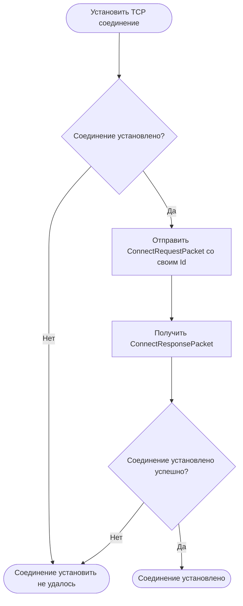
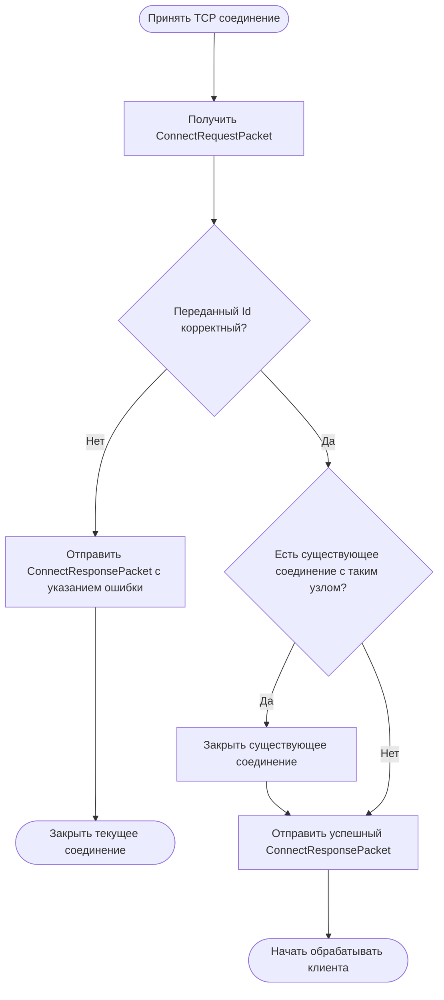

# Описание

Это протокол, который используется для взаимодействия между узлами кластера.
Используемые типы данных описаны в секции [сетевого протокола](network-protocol.md#структуры-данных).

> Замечание: для репликации используется протокол рафт, поэтому названия команд похожи/копируются

# Структуры данных

Для обмена данными используются указанные структуры данных:

| Название | Базовый размер | Описание                                           | Визуальное расположение |
|----------|----------------|----------------------------------------------------|-------------------------|
| Term     | 8 байт         | Значение терма                                     | Int64                   |
| Lsn      | 8 байт         | Значение индекс записи в логе. Log Sequence Number | Int64                   |

# Пакеты

> Для удобства, каждый маркер:
> 1. Обладает буквенным представлением в ASCII формате.
     Например, Byte('A') - байт со значением `65`.
> 2. Представляет заглавную букву, если запрос, и строчную, если ответ

Также, в конце каждого пакета добавляется чек-сумма.
Она рассчитывается по всем полям полезной нагрузки, без учета байта маркера.
Для его вычисления используется алгоритм, описанный в секции [чек-сумма](#чек-сумма).

## AppendEntriesRequest

Используется для отправки новых записей лога и Heartbeat (для поддержания в актуальном состоянии).
Если количество записей лога в поле `Entries` - 0, то это пакет Heartbeat.

Формат:

| Маркер    | Полный размер | Коммит | Терм | Предшествующий терм | Предшествующий индекс | ID отправителя | Кол-во записей | Терм записи | Данные записи | Выравнивание | Чек-сумма |
|-----------|---------------|--------|------|---------------------|-----------------------|----------------|----------------|-------------|---------------|--------------|-----------|
| Byte('A') | Int32         | Lsn    | Term | Term                | Lsn                   | UInt32         | UInt32         | Term        | Buffer        | Byte\[Var\]  | UInt32    | 

### TODO: вынести ID отправителя вперед

Поля `Терм записи`, `Данные записи` и `Смещение` образуют одну логическую запись лога.
Они повторяются столько, сколько указано в поле `Кол-во записей`.

Т.е. если в `Кол-во записей`:

- 0 - дальше ничего нет (Heartbeat запрос)
- 1 - дальше `Терм записи`|`Данные записи`
- 2 - дальше `Терм записи`|`Данные записи`|`Терм записи`|`Данные записи`

Поле `Полный размер` содержит полный размер пакета.
Нужен для быстрого выделения необходимого количества памяти при десериализации.

Дополнительно, присутствует поле `Выравнивание`.
Это поле содержит мусорные байты, которые необходимы для выравнивания данных по **8 байтной** границе.
Поэтому ее размер зависит от поля `Данные записи` и высчитывается как `Длина данных MOD 8`.

## AppendEntriesResponse

Отправляется в ответ на AppendEntriesRequest.

Формат:

| Маркер    | Терм | Успех | Чек-сумма |
|-----------|------|-------|-----------|
| Byte('a') | Term | Bool  | UInt32    |

Поля:

- `Терм` - терм, который был у принявшего команду узла.
- `Успех` - принял ли узел запрос.

## ConnectRequest

Отправляется одним узлом, когда тот хочет подключиться к другому узлу для коммуникации и репликации.

Формат:

| Маркер    | Id узла | Чек-сумма |
|-----------|---------|-----------|
| Byte('C') | Int32   | UInt32    |

## ConnectResponse

Отправляет узлом при получении им ConnectRequest пакета.
Уведомляет об успешности операции.
Если во время авторизации возникла ошибка (поле `Успех` - `false`),
то соединение разрывается.

Формат:

| Маркер    | Успех | Чек-сумма |
|-----------|-------|-----------|
| Byte('c') | Bool  | UInt32    |

## RequestVoteRequest

Используется, когда узел хочет отправить RequestVote запрос другому узлу.

Формат:

| Маркер    | Терм узла | Терм последней записи | Индекс последней записи | Id узла | Чек-сумма |
|-----------|-----------|-----------------------|-------------------------|---------|-----------|
| Byte('V') | Term      | Term                  | Lsn                     | Int32   | UInt32    |

## RequestVoteResponse

Используется для ответа на RequestVoteRequest пакет.

Формат:

| Маркер    | Терм | Успех | Чек-сумма |
|-----------|------|-------|-----------|
| Byte('v') | Term | Bool  | UInt32    |

## InstallSnapshotRequest

Используется, когда узел лидер хочет реплицировать состояние на узел последователь, если в логе нет нужных записей.

Формат:

| Маркер    | Терм | Id узла | Последний индекс | Последний терм | Чек-сумма |
|-----------|------|---------|------------------|----------------|-----------|
| Byte('S') | Term | Int32   | Int32            | Term           | UInt32    |

## InstallSnapshotChunkRequest

Используется для отправки файла снапшота, после отправки `InstallSnapshotRequest` пакета.

Формат:

| Маркер    | Чанк   | Чек-сумма |
|-----------|--------|-----------|
| Byte('B') | Buffer | UInt32    |

Если размер буфера в поле `Чанк` равен 0, то это означает конец передачи файла (для него также вычисляется чек-сумма).

Чек-сумма вычисляется для поля `Чанк`, включая длину.

## InstallSnapshotChunkResponse

Отправляется принимающим узлом в ответ на каждый успешно установленный чанк снапшота.

Формат:

| Маркер    | Чек-сумма |
|-----------|-----------|
| Byte('b') | UInt32    |

## InstallSnapshotResponse

Используется для ответа на InstallSnapshotRequest и InstallSnapshotChunk.
Отправляется каждый раз после получения каждого чанка данных из InstallSnapshotRequest.
Нужен для уведомления о готовности принимать следующий чанк и, при необходимости, известить об изменении терма (только
больший может быть).

Формат:

| Маркер    | Терм | Чек-сумма |
|-----------|------|-----------|
| Byte('s') | Term | UInt32    |

## RetransmitRequest

Получившая сторона отправляет этот пакет, в случае если полученный пакет нарушил целостность.
Например, переданная чек-сумма и рассчитанная не равны.
Когда кто-то получает этот пакет, то он должен повторить отправку предварительно отправленного пакета.

| Маркер    | Чек-сумма |
|-----------|-----------|
| Byte('R') | UInt32    |

# Чек сумма

Чек сумма используется для проверки целостности данных в принимаемом пакете.
Т.е. чек-сумма вычисляется только там, где присутствуют секции с пользовательскими данными.
Например, [`AppendEntriesRequest`](#appendentriesrequest)
или [`InstallSnapshotChunkRequest`](#installsnapshotchunkrequest).

Для создания используется алгоритм CRC32:

- Начальное значение: `0xFFFFFFFF`
- Полином: `0x04C11DB7`
- Зеркалированный: `Нет`
- XorOut: `0x0`

Замечание: параметры алгоритма такие же как у CRC32/MPEG2

# Основы (база)

Взаимодействие между узлами происходит по собственному сетевому протоколу.
Протокол работает поверх TCP.

Взаимодействие ведется по принципу Клиент-Сервер.
Одна сторона посылает сообщения, а другая на них отвечает.

В каждом соединении инициатором может быть только тот, кто это соединение и установил.
Для двустороннего взаимодействия необходимо установить 2 соединения: каждая сторона устанавливает свое.
Это необходимо для исключения гонок при сетевом взаимодействии.
Например, узел перешел в состояние Кандидата и начал слать всем RequestVoteRequest пакеты, и в это же время отправляет
AppendEntriesResponse пакет - на этом моменте может возникнуть ошибка одновременного доступа к сокету.

# Взаимодействие узлов

## Установление соединения

Установление соединения инициализирует клиент.

Алгоритм установления соединения (клиент):

Алгоритм установления соединения (сервер):

Замечания:

- На моменте проверки переданного в ConnectRequestPacket Id узла могут возникнуть следующие ошибки:
  - Переданный Id выходит за границы валидных значений (например, отрицательный);
  - Переданный Id указывает на Id текущего узла, т.е. того кто обрабатывает запрос;
  - Переданный Id находится не в диапазоне кластера (например, в кластере 3 узла, но переданный Id - 4);
- Может случиться так, что в узле уже существует открытое соединение с другим узлом с таким же Id.
  Это может случиться в случае, если старый узел аварийно остановился (TCP соединение открыто),
  и этот узел заново запустился и устанавливает новое соединение.
  В таких ситуациях, старое соединение закрывается (принудительно) и оно замещается новым.
- Переотправка сообщений в ответ на `RetransmitRequest` пакет не поддерживается.
  Соединение либо явно установлено, либо нет.

## Синхронизация лога

Основной смысл протокола - синхронизация лога.
В этом логе содержатся сериализованные команды, которые изменяют состояние приложения.

Для синхронизации есть 2 пакета (команды): AppendEntries и InstallSnapshot.
Обе команды управляют 2 потоками работы: синхронизация основного лога команд и отправка готового снапшота,
соответственно.

Протокол основан на алгоритме консенсуса Raft.
Я мало, что там изменил (включая названия полей), поэтому за пояснениями работы отправляю
к [самому протоколу](https://raft.github.io/raft.pdf).

## Проверка согласованности

В качестве дополнительной проверки целостности используются чек-суммы.

Они используются только для проверки пользовательских данных (записи лога либо чанки снапшота).
Т.е. в пакетах [`AppendEntriesRequest`](#appendentriesrequest)
или [`InstallSnapshotChunkRequest`](#installsnapshotchunkrequest).

В качестве чек-суммы используется алгоритм CRC32:

- Начальное значение: `0xFFFFFFFF`
- Полином: `0x04C11DB7`
- Зеркалированный: `Нет`
- XorOut: `0x0`

Замечание: параметры алгоритма такие же как у CRC32/MPEG2

При получении пакета с чек-суммой получатель должен проверить соответствие.
Если целостность была нарушена, то получающая сторона отправляет `RetransmitRequest` пакет.
Тогда отправляющая сторона должна повторить отправку сообщения.
Повторная отправка может выполняться несколько раз - ограничений не накладывается.

Данное поведение закладывается во все алгоритмы отправки пакетов и не прописывается явно, иначе слишком много текста
получится.
Если данное поведение нежелательно (как, например, при установлении соединения), то такое явно прописывается.

# Замечания

1. В одно время был соблазн добавить выравнивание пакетов после каждого маркера - добавлять 3 пустые байта, чтобы дальше
   все шло по выровненной, но после понял, что:
    1. При десериализации я всегда сначала читаю 1 байт - маркер, и после выделяю память для оставшегося пакета;
    2. При сериализации маркер отправляется отдельно и каждый конкретный пакет сериализует только свою полезную
       нагрузку.
       В итоге, выравнивание нужно добавить только для полезной нагрузки.