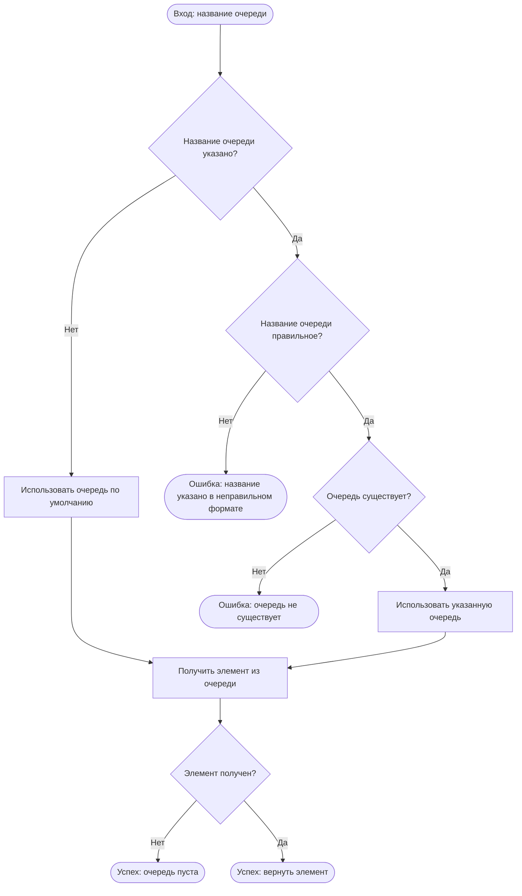

# Введение

В этом документе описана функциональность предоставляемая `TaskFlux`.
Это просто наброски, чтобы я сам понял чего хочу. Это не официальный документ.
Используйте (если кто-то вообще обратит внимание) его с осторожностью.

# Используемые врезки

`Замечание` - заметки по реализации. Полезны для программистов

`Примечание` - заметки по бизнес-логике/функциональности. Полезны для не программистов 

`TODO` - замечения и идеи, которые можно будет реализовать в будущем.
Полезны как не программистам (знать что планируется) так и программистам (есть причины и идеи реализации)

# Общее описание

`TaskFlux` - очередь задач. 
Кто-то добавляет в нее запись и указывает приоритет, а кто-то другой может прочитать самую приоритетную задачу.
Это не то же самое, что очередь сообщений (`RabbitMQ` или другие)  

## Чем является

### Producer-consumer

Основной паттерн поведения - синхронизация между различными сервисами.
Один сервис записывает - другой читает.

### Временный буфер

При паттерне работы `scatter-gather` можно создать временную очередь, которая будет аггрегировать результаты работы параллельных воркеров.
По окончании работы всех воркеров, главный поток может собрать все результаты выполнения и удалить очередь (чтобы не было коллизий названий).

## Чем не является 

### База данных

`TaskFlux` не предназначен для работы в качестве постоянного хранилища (хоть и имеет такие возможности).


# Заметки

## Очередь по умолчанию

В приложении всегда будет очередь по умолчанию. Она именуется "`default`".
Создается при первом запуске приложения.
Ее удалить нельзя.

# Функциональность

## Добавление записи

Эта операция добавляет новую запись в существующую очередь задач.

По завершении операции в очередь с указанным названием добавляется новый элемент с указанным приоритетом.

На вход операции нужно подать:
- Название очереди, куда вставлять элемент
- Приоритет
- Данные

Алгоритм работы:


> Если в очередь добавлена запись с уже существующим приоритетом, то не гарантируется, что добавленный элемент будет вставлен после существующего.
> Гарантии на очередность FIFO одинаковых ключей **нет**.

После успешного выполнения в указанную очередь добавляется элемент с указанными полезной нагрузкой и приоритетом.

Данные могут быть пустыми (нулевой размер). Приоритет должен быть указан.

## Чтение записи

Эта операция читает и тут-же удаляет прочитанную запись (забирает).

Для чтения записи нужно указать только название очереди, из которой нужно прочитать элемент.



## Создание очереди

Эта операция создает новую очередь с указанным названием.
На вход подаются:
- Название очереди
- Максимальный размер очереди

Алгоритм работы:


После успешного выполнения будет создана очередь с указанным названием

> TODO: надо добавить ограничение на размер нагрузки, но не в этой версии (сложна).
> Благодаря этому: защита от атак переполнения памяти (не затирание стэка), оптимизация использования памяти (пуллинг массивов) 

## Удаление очереди

Эта операция удаляет существующую очередь. 
После выполнения этой операции существующая очередь и ее содержимое будет удалено безвозвратно.


### Получение количества элементов в очереди

Эта операция позволяет получить количество элементов в очереди. 

Для операции необходимо только название очереди.


### Получение списка всех очередей

Эта операция позволяет получить список всех очередей, созданных в приложении.
Показываются только живые очереди - не удаленные.
Упорядоченность очередей не гарантируется.

В ответе передается список всех очередей и их настройки (свойства). 
На данный момент настройки это:
- Название очереди
- Максимальный размер

```text
Операция тривиальна, поэтому схемы нет
```

# Обработка ошибок

В случае возникновения ошибки во время обработки запроса клиента, не предусмотренной алгоритмом, клиенту отправляется сообщение об ошибке, сама ошибка логируется системой, а соединение с клиентом закрывается.
Само приложение при этом не закрывается.

При возникновении ошибки внутри приложения (не связанное с обработкой запроса), оно закрывается, перед этим логируя сообщение об ошибке.

# Возвращаемые ответы

Для каждого варианта взаимодействия возможны следующие исходы:

- Успешное выполнение.

Сигнализирует об успешном выполнении команды.

- Нарушение политик

Каждая очередь может иметь свои политики, описывающие различные ограничения.
Даже если путь выполнения правильный (очередь с указанным названием существует и т.д.), это не гарантирует того, что
никакая из политик не будет нарушена.
Строго говоря, нарушение политик не является ошибкой, поэтому данный тип поведения выделен отдельно.

- Ошибка

Ошибки могут возникнуть в результате неправильной бизнес-логики.
Например, создание очереди с уже существующим названием или удаление несуществующей очереди.
