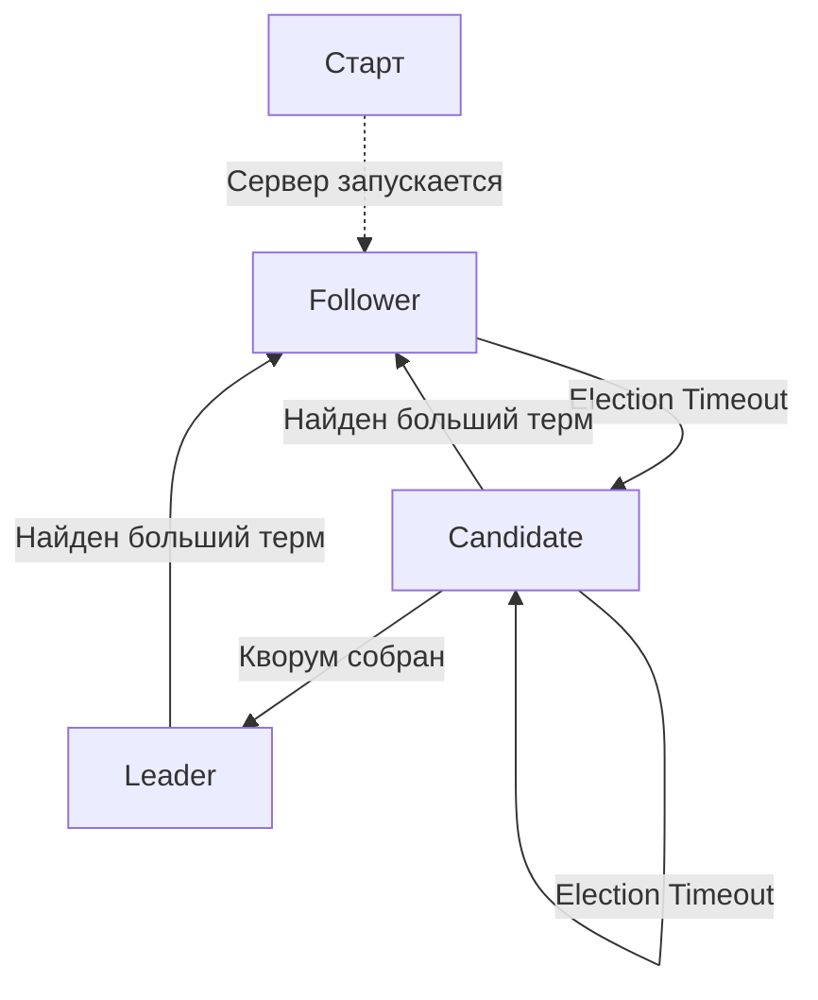

# Детали реализации алгоритма Raft

## Состояния

0. Follower (Последователь) - **F**
1. Candidate (Кандидат) - **C**
2. Leader (Лидер) - **L**

## Граф переходов

## Переходы

### Старт сервера

1. Переход в `Follower`
2. Запуск Election Timer

### `F -> C`

#### Election Timeout превышен

1. Сбросить Election Timeout
2. Проголосовать за себя - выставить поле VotedFor в свой Id
3. Начать собирать кворум 

### `C -> L`

#### Собран кворум

1. Остановить Election Timeout
2. Запустить Heartbeat Timeout
3. Начать отправлять Heartbeat на другие узлы

### `C -> C`

#### Превышен Election Timeout

1. Перейти в следующий терм
2. Обнулить все собранные голоса
3. Проголосовать за себя
4. Начать кворум заново

### `L -> F`

#### Получен Heartbeat с большим термом

1. Сбросить отданный голос
2. Выставить новый терм (как в Heartbeat)
3. Остановить отправку Heartbeat
4. Ответить на Heartbeat

#### Получен Request Vote с большим термом

1. Отдать голос за новый узел 
2. Выставить новый терм (как в RequestVote)
3. Остановить отправку Heartbeat
4. Ответить на RequestVote

