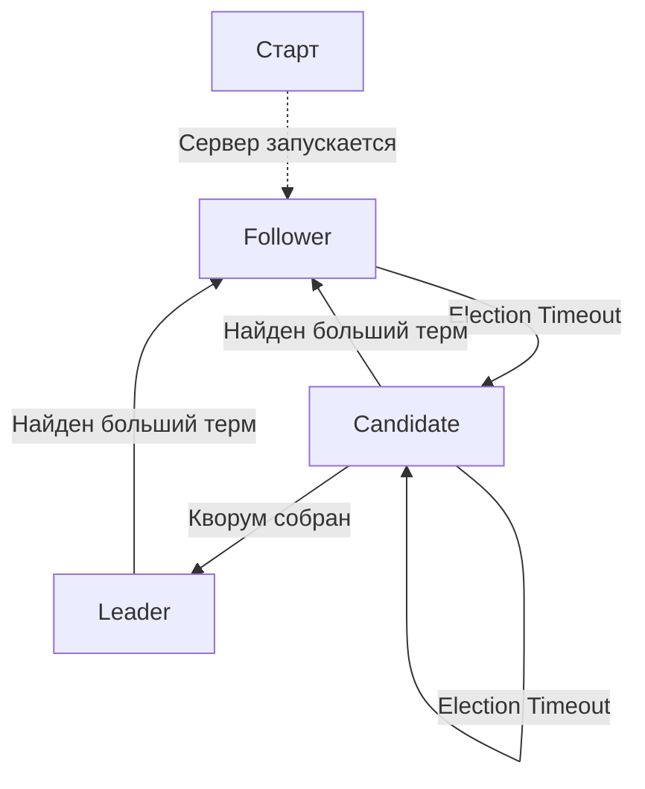

# Введение

`TaskFlux` использует алгоритм Raft для репликации.

Код для работы с ним лежит в папке `Consensus`.

На данный момент из рафта реализована только репликация без других фич: снашоттинг, изменение конфигурации и др.

# Детали реализации алгоритма Raft

В этой секции описаны некоторые детали реализации алгоритма Рафт, используемые в `TaskFlux`.

# Составные типы бинарных данных

Это список составных типов данных, использующиеся в файлах.
Эта часть расширяет типы указанные в [сетевом протоколе](network-protocol.md#бинарные-типы-данных).

| Название | Длина   | Базовый тип | Описание              |
|----------|---------|-------------|-----------------------|
| NodeId   | 4 байта | UInt32      | ID узла               |
| Term     | 4 байта | UInt32      | Терм (из Рафта)       |
| Index    | 4 байта | UInt32      | Индекс команды в логе |
| Marker   | 4 байта | Byte\[4]    | 4 байта маркера файла |

## Структуры данных

### NodeId

Представляет собой ID узла.
Используется `int` в качестве нижележащего типа.
Может принимать значения от 1 до 2147483647 (0 и отрицательные значения не допускаются).

### Term

Соответствует терму из Рафта.
Реализуется через `int`, но может принимать только положительные значения.

> Замечание: надо переделать под `uint` или `ulong` - зачем тратить дорогие биты?

## Состояния

Каждый узел в кластере в один момент времени имеет конкретную роль и
действия на приходящие команды зависят от него.

В `TaskFlux` используется паттерн [`Состояние`](https://ru.wikipedia.org/wiki/Состояние_(шаблон_проектирования))
для работы с ролями.
Каждая роль представляется отдельным классом.

0. Follower (Последователь) - **F**
1. Candidate (Кандидат) - **C**
2. Leader (Лидер) - **L**

## Граф переходов

## Переходы

### Старт сервера

1. Переход в `Follower`
2. Запуск Election Timer

### `F -> C`

#### Election Timeout превышен

1. Сбросить Election Timeout
2. Проголосовать за себя - выставить поле VotedFor в свой Id
3. Начать собирать кворум 

### `C -> L`

#### Собран кворум

1. Остановить Election Timeout
2. Запустить Heartbeat Timeout
3. Начать отправлять Heartbeat на другие узлы

### `C -> C`

#### Превышен Election Timeout

1. Перейти в следующий терм
2. Обнулить все собранные голоса
3. Проголосовать за себя
4. Начать кворум заново

### `L -> F`

#### Получен Heartbeat с большим термом

1. Сбросить отданный голос
2. Выставить новый терм (как в Heartbeat)
3. Остановить отправку Heartbeat
4. Ответить на Heartbeat

#### Получен Request Vote с большим термом

1. Отдать голос за новый узел
2. Выставить новый терм (как в RequestVote)
3. Остановить отправку Heartbeat
4. Ответить на RequestVote

# Снапшоттинг

Для оптимизации памяти Raft использует снапшоттинг - сброс на диск состояния машины с отбрасыванием части лога ей
соответствующей.

В `TaskFlux` снапшоты делаются при достижении определенного размера лога.
Максимальный размер лога указывается в конфигурации.

Снапшоты отправлются от лидера к последователю, когда лидер не имеет нужных записей лога.
Т.е. в обычной ситуации лидер всегда отправляет записи лога, за исключением моментов, когда
лидер сделал снапшот, удалил записи лога, а последователь требует удаленные записи.

В файле снапшота хранится все состояние системы (все очереди).

> TODO: лучше сделать разделение по очередям - на каждую очередь свой снапшот (и, соответственно, лог).

## Условия создания снапшотов

Снапшоты выполняются при достижении максимального размера лога.

Максимальный размер лога должен представляется в мегабайтах.
Значение по умолчанию - 16 Мб.

Снапшот создается, если при добавлении в лог новой записи размер файла лога
будет выходить за пределы максимального значения и только после коммита команды.
То есть, проверка будет происходить каждый раз после коммита лога.

## Формат файла

| Маркер | Последний индекс | Последний терм | Состояние |
|--------|------------------|----------------|-----------|
| Marker | Index            | Term           | Byte[]    |

> TODO: пока файл снапшота будет такого размера, сколько необходимо для хранения.
> В будущем, сделаю его расширение большими чанками, либо сразу задавать необходимый размер.

Поле `Состояние` представлено диапазоном байтов.
Он начинается сразу после поля `Последний терм` и заканчивается вместе с файлом (пока размер хранить не буду).

Более полное описание представлено в [технической спецификации](tech-spec.md#consensusraftsnapshot)

# Репликация снапшота

Для оптимизации использования диска, чтобы файл лога не разрастался, используется снапшоттинг:
когда файл лога превышает лимит (сейчас 16 Мб), то создается слепок состояния, и все команды предшествующие последней
команде из лога удаляются.

Новый снапшот может быть создан в 2 случаях:

- При обработке `AppendEntries` запроса - лог может вырасти.
- При подключении нового узла последователя - лидер может иметь снапшот, у которого индекс последней команды больше
  последнего индекса в логе последователя.

## AppendEntries

В случае если во время обработки (и дописывания) команды в файл лога он превысил лимит, должен создаться файл лога.

> Замечание: хотелось бы, чтобы файл лога не превышал свое максимальное значение всегда, но может возникнуть ситуации,
> когда это случилось.
> Грустно, конечно, но не смертельно.

Проверка превышения размера проводится после добавления всех команд в файл лога.
Если размер был превышен, то:

1. Создается слепок состояния (сейчас это просто сериализация каждой очереди)
2. Создается временный файл снапшота
3. В созданный файл записываются данные
4. Старый (если существовал) снапшот заменяется новым
5. Файл лога очищается (не закоммиченные/буфер не трогается)

Создание файла снапшота делается синхронно - пока новый снапшот не будет создан, ответ не отошлется и новые запросы
присылаться не будут.

## InstallSnapshot

Если к лидеру подключился узел, лог которого отстает от нашего, используется запрос `InstallsSnapshot`.

Это может быть только тогда, когда первый индекс лога лидера больше последнего индекса лога последователя.

Например, последний индекс команды в снапшоте - 4, тогда первый индекс команды в логе - 5, а последний индекс лога
последователя - 3.

Алгоритм работы (Л - лидер, П - последователь):

1. Л отправляет `InstallSnapshotRequest`
2. Если П готов принимать чанк (например, другой узел не стал Лидером или наш терм больше П), то:
    1. П отправляет `InstallSnapshotChunkResponse`

   Иначе:
    1. П отправляет `InstallSnapshotResponse`, в котором прикладывает свой Терм (он должен быть больше)
    2. Работа завершается
3. Л отправляет чанка снапшота через `InstallSnapshotChunkRequest`
    - Если размер отправляемого чанка - 0
        1. Переходим к следующему
    - Если терм лидера меньше нашего (во время создания чанка обновили терм от другого лидера)
        1. П отправляет `InstallSnapshotResponse` со своим (большим) термом
        2. П удаляет созданный файл снапшота
        3. Работа заканчивается
4. П обновляет чанк снапшота
5. П отправляет успешный `InstallSnapshotResponse`

В алгоритме используются только лидер и последователь, т.к. кандидат при получении этого запроса должен:

- Либо ответить отказом, т.к. терм меньше
- Либо стать последователем, т.к. терм либо одинаковый (лидер текущего терма есть), либо обновит до большего и станет
  последователем
